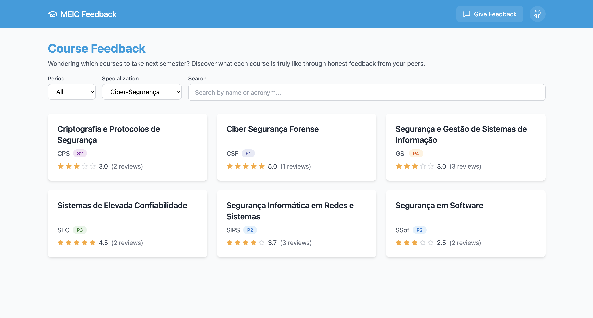

# MEIC Feedback

**Wondering which courses to take next semester?**
Discover what each course is truly like through honest anonymous feedback from your peers!

Visit [meic-feedback.afonsocrg.com](https://meic-feedback.afonsocrg.com) to explore course ratings and reviews!

---

⚠️ If this project was useful to you, please consider giving your own feedback on the courses you did last semester.
Other students will thank you for it! ❤️

---

## Adding your own feedback

I'm currently adding functionality to let you add your feedback in the [website](https://meic-feedback.afonsocrg.com) itself, but while that's not available, I ask you to either create a [PR](https://github.com/afonsocrg/MEIC-feedback/pulls) or send me a message with your feedback!

## Contributing

The sole purpose of this project is to help students choosing the right courses for them.
If you find any bug or there's a feature you'd like to see, feel free to open an [issue](https://github.com/afonsocrg/MEIC-feedback/issues) or a [PR](https://github.com/afonsocrg/MEIC-feedback/pulls)!

---

This repo contains a collection of anonymous feedbacks from MEIC students about the courses they've taken.
Feel free to explore the [courses](./courses) directory to see the feedbacks that we've been collecting over the years.
That directory has one file per course, with the feedbacks from the students who took that course.

We've also added two indices, to help you find the courses you're looking for:
- [by specialization](./indices/by_specialization.md)
- [by period](./indices/by_period.md)

